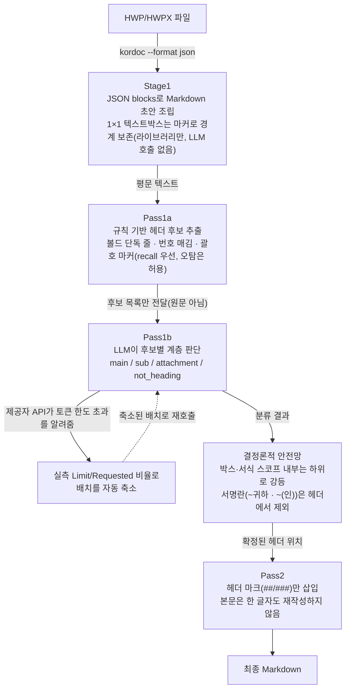

# hwp-hierarchical-md

계층 구조를 가진 한글(HWP/HWPX) 공문서를, 원문의 섹션 계층(대분류·중분류·첨부)을 보존한 채
Markdown으로 변환하는 [Claude Code Skill](https://docs.claude.com/)이다. 한국 공공기관 입찰공고문
42건을 대상으로 검증했다.

> [Claude Code](https://claude.com/claude-code)와 함께 설계·구현했다. 아키텍처 결정(2-pass 분리,
> 결정론적 안전망 규칙 등)은 실제 실패 사례를 근거로 세션 중 반복적으로 검증·수정한 것이다 — 그
> 과정은 [`docs/DESIGN_PROCESS.md`](docs/DESIGN_PROCESS.md)에 정리했다.

## 문제

HWP→Markdown 변환 라이브러리(예: [`kordoc`](https://www.npmjs.com/package/kordoc))는 표·서식·
읽기 순서는 충실히 보존하지만, "이 줄이 최상위 섹션 제목인지, 그 하위 세부항목인지, 아니면 서명란
같은 비-헤더인지"는 판단하지 못한다. 원문 스타일 메타데이터(폰트 크기, 볼드 여부)만으로는 계층을
안정적으로 재구성할 수 없다 — 같은 "1. 2. 3." 번호 매김이 문서 최상위 섹션에도, 그 안의
체크리스트에도, 별도 첨부(붙임/서식)에도 반복해서 쓰이기 때문이다. 그렇다고 LLM에게 문서 전체를
통째로 다시 쓰게 하면, 문단이 빠지거나 없는 헤더가 생기는 등 콘텐츠 손실 위험이 생긴다.

## 접근: "판단"과 "변환"을 분리한다

이 프로젝트의 핵심 설계 원칙은 하나다 — **LLM은 판단만 하고, 문서를 다시 쓰지 않는다.**

판단과 변환을 분리한다 — 후보를 뽑는 규칙(Pass1a)과 문장을 다시 쓰는 일(Pass2)엔 LLM을 안 쓴다.
LLM은 오직 "이 줄이 헤더인가"라는 좁은 판단(Pass1b)에만 쓰여서, 문단 누락이나 헤더 날조 같은
위험이 설계적으로 배제된다.

후보 목록만 LLM에 넘기기 때문에 문서가 길어져도 LLM 호출 비용이 거의 늘지 않고, LLM이 "판단"만
하고 "생성"은 하지 않으므로 문단 누락·헤더 날조 같은 위험이 설계적으로 배제된다.

### 결정론적 안전망 — 왜 필요한가

LLM 분류만으로는 반복되는 패턴을 놓쳤다. 예를 들어:

- **텍스트박스(콜아웃) 내부 콘텐츠**: 원본 HWP의 1×1 텍스트박스 안 체크리스트가 문서 최상위 섹션
  번호와 겹치는 번호를 쓰는 경우, LLM이 문맥 없이 번호만 보고 최상위로 오분류했다. kordoc JSON의
  `rows==1, cols==1` 표 정보를 이용해 경계를 보존하고, 박스 안 콘텐츠는 항상 하위로 강제한다.
- **첨부(붙임/서식) 스코프 내부 콘텐츠**: "【서식 7】 이행능력심사..." 같은 괄호 마커로 시작하는
  첨부 문서 내부의 소제목("3. 회사를 대표하는 연락책임자 인적사항" 등)이 문맥 없이 최상위 섹션으로
  오분류됐다. 괄호 마커 구조(특정 단어를 하드코딩하지 않음)로 앵커를 잡고, 그 앵커부터 다음 마커
  전까지를 스코프로 잡아 내부 콘텐츠를 하위로 강등한다.
- **서명/날인란**: "OO 귀하"(수신처 인사말), "대표자: (인)"(응찰자 서명란) 같은 줄이 간헐적으로
  헤더로 오분류됐다. 두 패턴 모두 42개 문서 전수 조사에서 오탐 0건으로 확인된 안전한 결정론적
  규칙으로 처리한다.

이런 규칙은 모두 "이미 LLM이 확정한 판단"이나 "라이브러리가 보존한 구조 정보"에만 반응하는 좁은
범위로 설계했다 — "번호가 이어지면 최상위" 같은 전역 규칙은 의도적으로 쓰지 않는다. 붙임/별첨에서
번호가 정당하게 1부터 리셋되는 경우를 오탐해서 반복적으로 실패했기 때문이다.

## 검증

한국 나라장터(국가종합전자조달시스템)에 게시된 실제 입찰공고문 42건(학교·공공기관 발주, 물품
구매·공사·용역 등 다양한 유형)으로 검증했다. 원본 문서 자체는 실제 기관의 저작물이라 이 저장소에
포함하지 않는다(참고: 한국 저작권법 제7조 2호에 따라 국가·지방자치단체의 공고는 저작권 보호 대상이
아니다). 검증 지표:

- **콘텐츠 보존율**: Stage1(원문 추출) 대비 Pass2(최종 출력) 문자 수 비율 42건 전체 0.95~1.10 범위
  — 헤더 마크 삽입 외 본문 유실/왜곡 없음
- **섹션 번호 연속성**: main_section 번호 시퀀스 42건 전체에서 중복·비정상 갭 0건
- **표 구조**: rowspan/colspan 병합 셀 처리, 밑줄 태그·PUA 유니코드 잔재 제거. 실제 헤더가
  없는 표(라벨:값 나열형)나 2단 헤더(대분류+소분류) 표도 GFM pipe-table 문법이 헤더 행을
  강제하는 것과 무관하게 정확히 처리한다 — 헤더 없는 표는 애초에 표로 안 만들고 `label: value`
  텍스트로 직행하고, 연속된 헤더 행은 컬럼별로 하나로 합친다(`normalize_html_tables.py`).
  RAG 파서로 쓸 때(다운스트림이 표를 자연어로 다시 평탄화하는 경우) 다운스트림이 "이게 진짜
  헤더인지 위장된 헤더인지"를 텍스트 패턴만으로 추측할 필요가 없어진다.

## 요구사항 및 사용법

[SKILL.md](https://github.com/adover134/korean_official_document_parser_skill/blob/main/SKILL.md) 참고.

## 라이선스

MIT
